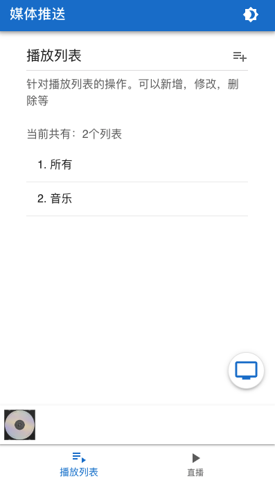
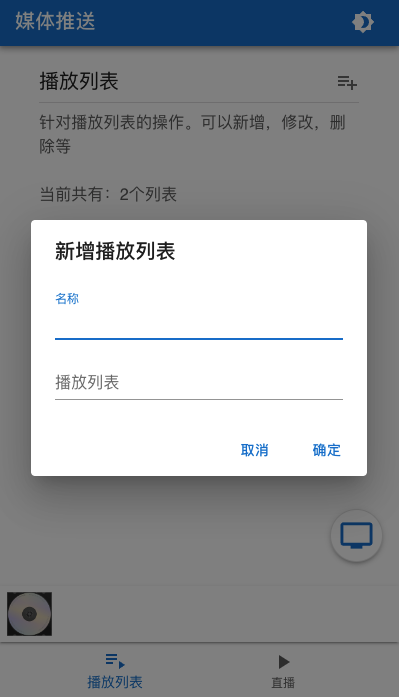
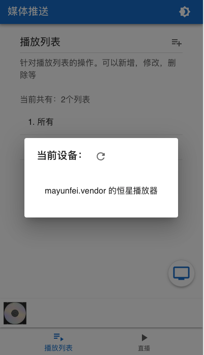
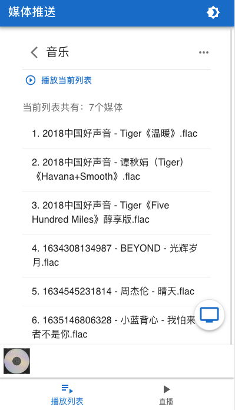
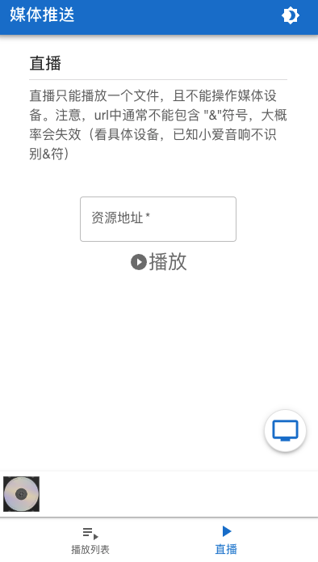

# DLNA-HOME

This go software can push your media urls to DLNA devices connected with your local network.

Codebase is based on project [go2tv](https://github.com/alexballas/go2tv).


# Usage
After starting the execuable file, you can visit site: http://network-ip:8081, and you can see a page:



You can change the theme by clicking the most right and top button. You can add a playlist by clicking the button on the right side of "播放列表". 



You can fill the form with name and items. e.g.
```text
name(名称): songs
list(播放列表): [{"name": "song1.mp3", "url": "one http(s) link"}]
```

The `list` should be a JSON with below signature:
```ts
type List = {
    name: string;
    url: string;
}[]
```

After adding, press submit(确定), then you can see the one you filled. 

Pressing the right side floating tv button, you can see a device list avaiable in your local network.  e.g. 



You should select a device to operate.

Then you can click one playlist item. e.g. 



Click play(播放当前列表), can start push url infos to media device. 

In player page,


You can drag progress bar, volume bar, next song, prev song, and change play mode. 

On the other hand, you can directly push one url to device by direct play(直播): 


After selecting device and filling url, just click play(播放), then the url is sent to the device.

# Develop
```bash
# generate front end assets：
statik --src=assets -f
# generate execuable file:
# see below `Build on platform`
```

# Build on platform
```bash
windows: CGO_ENABLED=0 GOOS=windows GOARCH=amd64 go build -o easy_up_cloud.exe
linux: CGO_ENABLED=0 GOOS=linux GOARCH=amd64 go build -o easy_up_cloud_linux
mac: CGO_ENABLED=0 GOOS=darwin GOARCH=amd64 go build -o easy_up_cloud_mac
```

# Want help
Any ideas or contributes are welcomed!

# Next
- Support web i18n

# android
GIN_MODE=release GO386='softfloat' ANDROID_NDK_HOME=/Users/tanzhixuan/Library/Android/sdk/ndk/23.1.7779620 fyne package -os android/arm64 